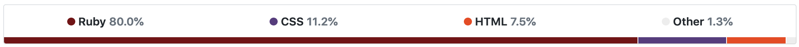
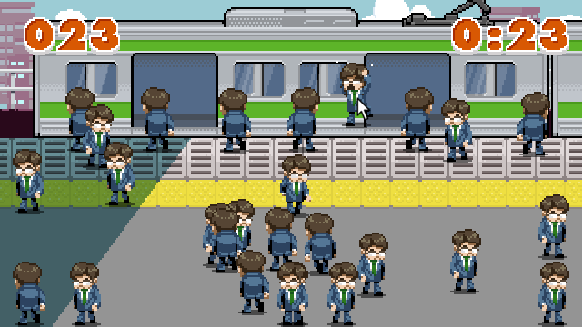
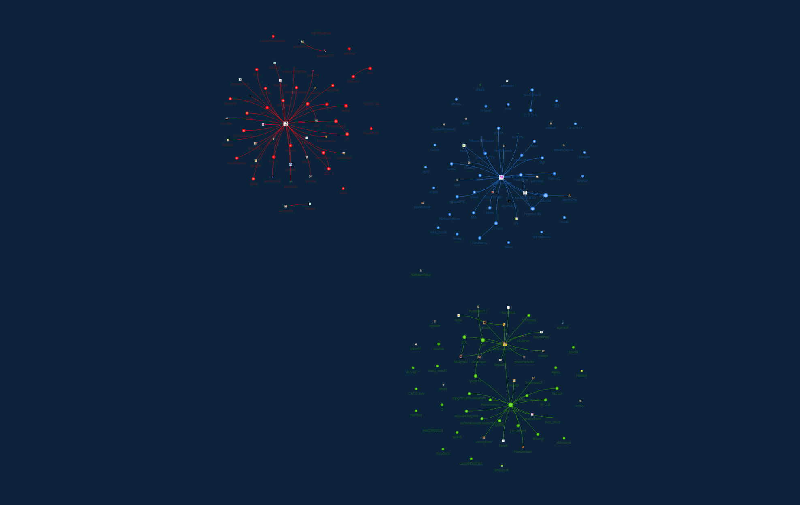
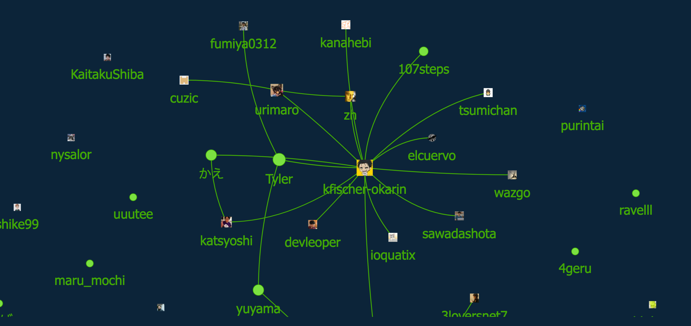
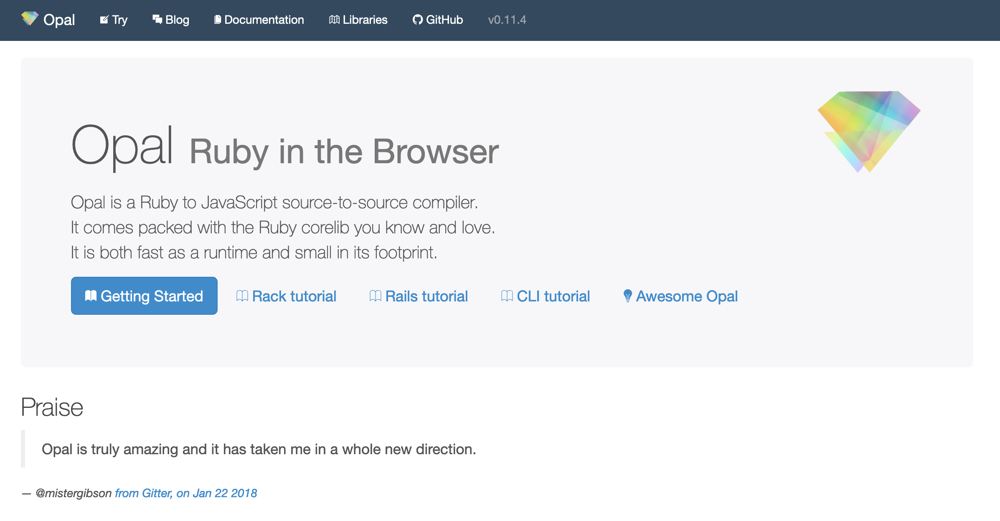
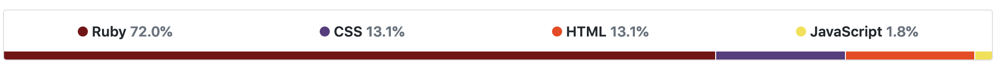
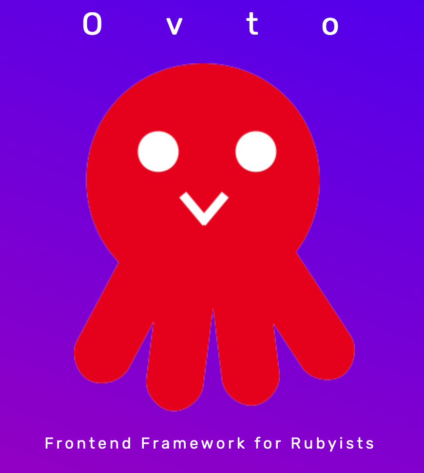
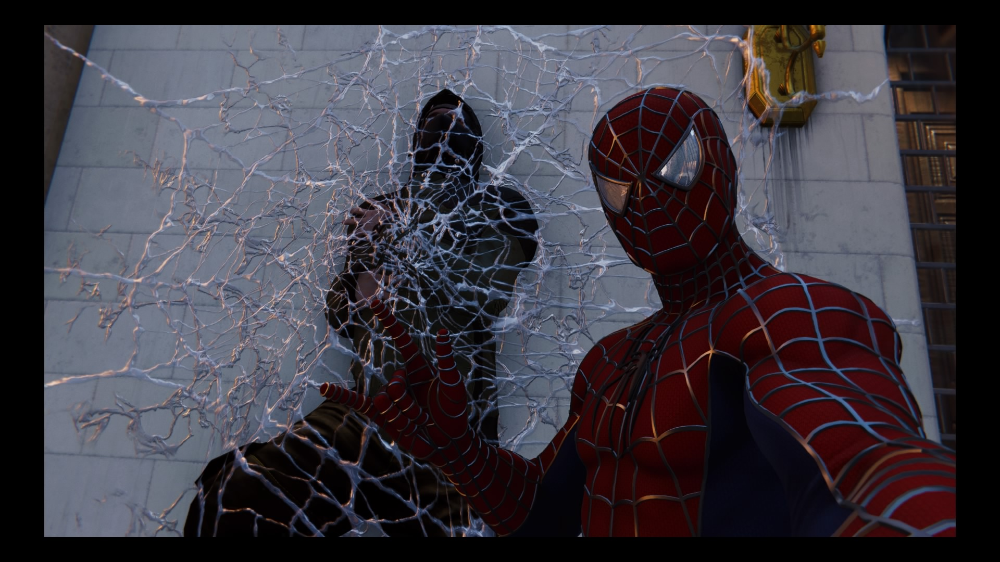

# Go for it! 100% Ruby

## To all Rubyists that hate Javascript



by Kevin Fischer / @kfischer_okarin

---

## Kevin Fischer


{: class="top-right" style="width: 25%"}

* Born and raised in Germany
* Christian, believing in and
  following Jesus Christ
* Programmer at Agileware since 2016
* Married since January

```note
クリスチャンです。つまり、イエス・クリストを信じて、ついていく人です。
```

---




---


```note
ニューヨークの街を飛び回ったりしています。
```

---

## Kaigress - Overview



---

## Kaigress - My Network



---

## What I will talk about

* Rewriting the (small) frontend of Kaigress from Slim to Opal+Ferro
* My impression

---

## Adding gems

```ruby
# Gemfile

gem 'opal', '~> 0.11.4'
gem 'opal-rails'
gem 'opal-ferro', '~> 0.11.0'
```

---

## Adding gems

```ruby
# Gemfile

gem 'opal', '~> 0.11.4' <-------------------
gem 'opal-rails'
gem 'opal-ferro', '~> 0.11.0'
```

---

## Opal

https://github.com/opal/opal



---

## Adding gems

```ruby
# Gemfile

gem 'opal', '~> 0.11.4' <-------------------
gem 'opal-rails'
gem 'opal-ferro', '~> 0.11.0'
```

---

## Adding gems

```ruby
# Gemfile

gem 'opal', '~> 0.11.4'
gem 'opal-rails' <--------------------------
gem 'opal-ferro', '~> 0.11.0'
```

---

## opal-rails - Sprockets

Adds a sprockets extension for js.rb files, so this

```js
// application.js

//= require rails-ujs
//= require opal
//= require turbolinks
//= require_tree .
```

---

## opal-rails - Sprockets

can be written like this and is automatically compiled to Javascript.

```ruby
# application.js.rb

require 'rails-ujs'
require 'opal'
require 'turbolinks'
require_tree '.'
```

---

## opal-rails - Opal Templates

```ruby
# app/views/users/_new.js.opal

class NewUserView
  # Fancy UI Framework stuff
end

NewUserView.new.render
```

---

## Adding gems

```ruby
# Gemfile

gem 'opal', '~> 0.11.4'
gem 'opal-rails' <--------------------------
gem 'opal-ferro', '~> 0.11.0'
```

---

## Adding gems

```ruby
# Gemfile

gem 'opal', '~> 0.11.4'
gem 'opal-rails'
gem 'opal-ferro', '~> 0.11.0' <-------------
```

---

## Let's start rewriting

---

{: style="width: 50%"}

---

```erb
  <div class="panel">
    <div class="panel-header">
      <h1 class="panel-title"><%= @user.nickname %></h1>
    </div>
    <div class="panel-body">
      <p class="<%= @user.team %>">Team: <%= @user.team %></p>
    </div>
  </div>
  <div class="panel">
    <div class="panel-header">
      <h1 class="panel-title">Your QR-Code</h1>
    </div>
    <div class="panel-body">
      <%= qr_code_for @user %>
    </div>
  </div>
```

---

```erb
  <div class="panel">
    <div class="panel-header">
      <h1 class="panel-title"><%= @user.nickname %></h1>
    </div>
    <div class="panel-body">
      <p class="<%= @user.team %>">Team: <%= @user.team %></p>
    </div>
  </div>
```

---

```erb
  <div class="panel">
    <div class="panel-header">
      <h1 class="panel-title">TITLE</h1>
    </div>
    <div class="panel-body">CONTENT</div>
  </div>
```

---

```ruby
class Panel < Ferro::Component::Base
end
```

---

```ruby
class Panel < Ferro::Component::Base
  def cascade
    add_child :header, Header, title: 'Title'
    add_child :body, Body, content: 'Content'
  end
end
```

---

```ruby
class Body < Ferro::Component::Base
  # content is automatically added as Text Node
end
```

---

```erb
  <div class="panel">
    <div class="panel-header">
      <h1 class="panel-title">TITLE</h1>
    </div>
    <div class="panel-body">CONTENT</div>
  </div>
```

---

```ruby
class Header < Ferro::Component::Base
  def before_create
    @title = option_replace :title
  end

  def cascade
    add_child :title, Title, content: @title
  end
end
```

---

```ruby
class Title < Ferro::Component::Text
  def before_create
    @size = 1  # becomes h1 tag
    # Do nothing with content, it will become a text node
  end
end
```

---

```ruby
class Panel < Ferro::Component::Base
  class Title; ...; end
  class Header; ...; end
  class Body; ...; end

  def cascade
    add_child :header, Header, title: 'title'
    add_child :body, Body, content: 'content'
  end
end
```

---

## What about CSS?

---

```css
.panel { /* Will be applied to Ruby class Panel */
  /* ... */
}

.panel-body { /* Will be applied to Ruby class Panel::Body */
  /* ... */
}
```

---

## My impression about writing an app with Ferro

---

## Pro
### It was nice using more Ruby



:arrow_down:


---

## Con
### Using opal-rails efficiently was not so easy

---

## Pro
### In the end, the single used action view became quite elegant

```erb
<%=
  javascript_include_tag
    "app/pages/#{controller.controller_name}/#{controller.action_name}"
%>

<script>
  <%= render partial: controller.action_name, formats: :js %>
</script>
```

---

## Con
### Not too well documented, had to browse the source code quite a bit

---

## It want to try...

{: style="width: 50%"}

---

## Thank you for listening



---

### PS: We're hiring
